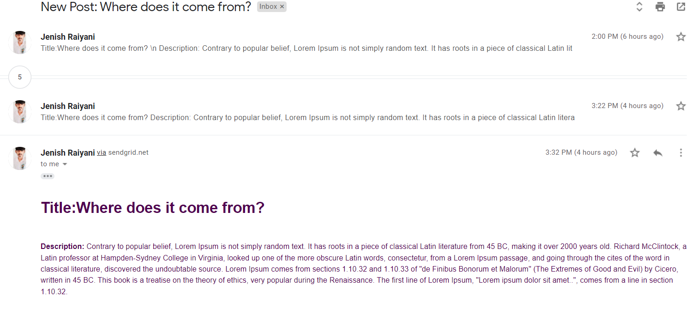

# Subscription Platform
This task is developed using laravel 8 framework.
## Technologies

- HTML
- CSS
- JavaScript
- PHP
- MYSQL


## Email sending service

- the SendGrid API sends mail to all subscribers.

## About cron job (command)
``` php
- php artisan tinker
- app()->call('App\Http\Controllers\SendmailController@sendTestEmails');
```

## Testing


